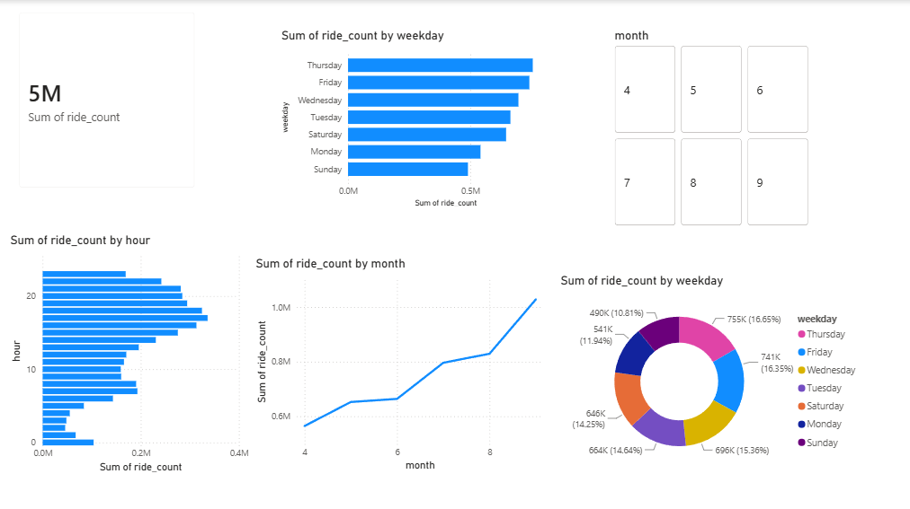

# uber-ride-analytics
Uber Ride Analytics &amp; Demand Forecasting - EDA, ML Model, Power BI Dashboard

# 🚖 Uber Ride Analytics & Demand Forecasting



## 📌 Project Overview
An end-to-end Data Analytics project analyzing 4.5 million+ Uber ride records from New York City (April–September 2014) to uncover demand patterns, peak hours, and build a Machine Learning model to forecast ride demand with 94.23% accuracy.

## 🎯 Objectives
- Analyze Uber ride demand patterns across hours, days, and months
- Identify peak demand zones and rush hour behavior
- Build an ML model to forecast hourly ride demand
- Create an interactive Power BI dashboard for business insights

## 📊 Dataset
- **Source:** [Uber Pickups in New York City — Kaggle](https://www.kaggle.com/datasets/fivethirtyeight/uber-tlc-foil-response)
- **Records:** 4.5 million+ Uber pickups
- **Period:** April 2014 — September 2014
- **Features:** Date/Time, Latitude, Longitude, Base

## 🔍 Key Insights
- **Peak Hour:** 5 PM (17:00) has the highest ride demand — evening rush hour
- **Low Demand:** 3 AM - 5 AM across all days — minimum demand
- **Busiest Day:** Thursday has the most rides — Sunday has the lowest
- **Monthly Growth:** Rides grew ~80% from April (580K) to September (1M+) in 2014
- **Rush Hours:** 33.1% of all rides happen during rush hours (7-9 AM, 5-7 PM)
- **Busiest Base:** B02617 handles the most rides among 5 dispatch centers
- **Weekend Pattern:** Late night demand spikes on Saturday midnight — nightlife driven
- **Weekday Pattern:** Commute driven demand — peaks at office hours (5-6 PM)
- **Correlation:** Hour of day is consistent across all days and months — demand is highly predictable
- **Key Driver:** Hour of day is the #1 factor predicting ride demand (0.6 importance score)

## 🤖 ML Model
- **Algorithm:** Random Forest Regressor
- **Features:** Hour, Day, Month, Weekday
- **Accuracy:** 94.23% (R² Score: 0.9423)
- **MAE:** 96.59 rides per hour

## 📈 Visualizations
1. Rides by Hour of Day
2. Rides by Day of Week
3. Rides by Month
4. Heatmap — Hour vs Day of Week
5. Rides by Base/Dispatch Center
6. Rush Hour vs Non-Rush Hour (Pie Chart)
7. Monthly Growth Trend (Line Chart)
8. Correlation Heatmap — Time Features
9. Actual vs Predicted Ride Demand
10. Feature Importance — What Drives Uber Demand

## 📊 Power BI Dashboard
Interactive dashboard with:
- Total Rides KPI Card
- Rides by Hour Bar Chart
- Rides by Weekday Bar Chart
- Monthly Growth Line Chart
- Weekday Distribution Donut Chart
- Month Slicer for dynamic filtering

## 🛠️ Tech Stack
- **Python** — Pandas, NumPy, Matplotlib, Seaborn, Scikit-Learn
- **ML Model** — Random Forest Regressor
- **Visualization** — Matplotlib, Seaborn, Power BI
- **Environment** — Google Colab, Jupyter Notebook
- **Version Control** — Git, GitHub

## 📁 Repository Structure
uber-ride-analytics/
├── uber_ride_analytics.ipynb       ← Main analysis notebook
├── uber_hourly_demand.csv          ← Processed hourly demand data
├── Uber_Ride_Analytics_Dashboard.pbix  ← Power BI dashboard
├── Uber_Analytics_Dashboard.png    ← Dashboard screenshot
├── Uber-Ride-Insights-Report.pdf   ← Detailed insights report
└── README.md

## 🚀 How to Run
1. Clone the repository
```bash
git clone https://github.com/saifkhan727/uber-ride-analytics.git
```
2. Download the dataset from Kaggle link above
3. Open `uber_ride_analytics.ipynb` in Google Colab or Jupyter Notebook
4. Run all cells sequentially

## 👤 Author
**Saif Akhtar Khan**
- LinkedIn: [linkedin.com/in/saifkhan07](https://linkedin.com/in/saifkhan07)
- GitHub: [github.com/saifkhan727](https://github.com/saifkhan727)
- Email: imsaifakhtarkhan@gmail.com
